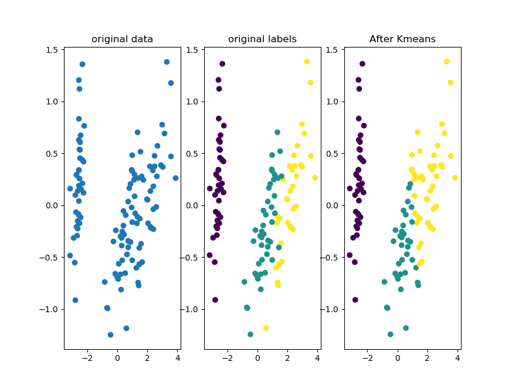

# Machine-learning

# 1.[感知机perceptron](perceptron.py)

算法思想：在线性可分的数据中，寻找一个超平面，使该数据的正例点和负例点能够被完全正确分类。

模型：f(x)=sign(w*x+b)

损失函数：minL(w,b)=-Σy(w*x+b)

当损失函数的值为0时，说明没有误分类点，所有的类别都分类正确！

visual:

参考文献：李航.统计学习方法

# 2.[聚类Kmeans](Kmeans.py)

Kmeans属于无监督学习

算法思想：定义K个质心(类)，并且每个样本到质心的距离最短则归为该类。每个更新质心的时候，用该类的均值取代。

缺点：Kmeans最后的分类效果和初始的质心有关联，所以最后算出的结果，可能不是全局最优。

visual:

